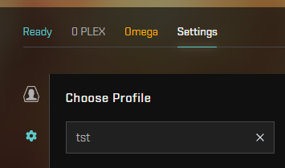
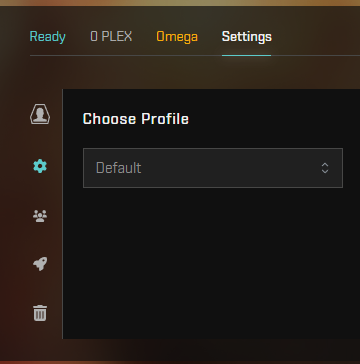

# Script to copy EVE online settings between characters and accounts on same computer

**ATTENTION! You need to have python 3 interpreter installed in system!** [download](https://www.python.org/downloads/) or [install from Microsoft store](https://www.microsoft.com/store/productId/9NRWMJP3717K)

Main feature is to copy selected or latest EVE online settings over all other in settings folder.

## General workflow

**General rule** for this workflow - character, from which settings should be copyed, should be used latest.

1. Install python 3
2. Download `settings_replacer.py`, `sync_settings.cmd` and `open_settings_folder.cmd` to local machine in same folder
3. In same folder with files from step 2 create file named `game_folder.txt` and write here path to game folder installation. Usually it ends with `EVE` like `D:\EVE`. This folder usually contains folders like `tq` and `ResFiles`. Check `game_folder.txt.example` for example.
4. _Optional_ if you have custom named profile - in same folder with files from step 2 create file named `profile_name.txt` and write profile name in it. Same as it written in your client. Example:

   

   `tst` in this case

5. Double click `open_settings_folder.cmd` - it'll open EVE online profiles folder. Backup your current profiles somwhere.
6. Run game with character from which settings should be copyed to other characters and accounts. Close game (_optional_).
7. Double-click `sync_settings.cmd`. Press any key to close console window.

If you started new character, and notice that it have missed settings - **DON'T RUN THE SCRIPT!**. Because then not correct character settings will be copyed to all others. Because this caracter was used latest.

Instead of it - close the game, run game with characrer with correct settings. Only then run the script!

## Thecnical details

In windows settings stored in user's folder like: `C:\Users\<USERNAME>\AppData\Local\CCP\EVE\c_ccp_eve_online_tq_tranquility` where `<UAERNAME>` is your current system username. This folder is for traquility server profiles so it contains filders like `settings_Default` for default settings profile and `settings_<PROFILE>` for custom if you've been created one:

Settings stored in files with names like:

- `core_user_<ID>.dat` for account settings (graphics, audio, keyboard shortcuts, etc)
- `core_char_<ID>.dat` for characrer settings (all UI settings like windows positions, buttons insidebar, etc)

`<ID>` here is string of numbers.

Script work in 2 modes: fully automated, with target settings file provided.

### 1. Fully automated

In this mode just run the script and it will find in settings folder which name is set in `profile_name.txt` file or in `Default` profile (if file with profile name not found). Check `profile_name.txt.example` for example.

To run script in Windows just doubleclick `sync_settings.cmd`.

### 2. With target settings file provided

If you run script with path to target settings file - this file will be used to replace all other settings files in folder.

Example:

`python3.exe settings_replacer.py C:\Users\me\AppData\Local\CCP\EVE\c_ccp_eve_online_tq_tranquility\settings_Default\core_char_123321123321123321123.dat`

It can be simplified in Windows by dropping target file on `sync_settings.cmd` file.
